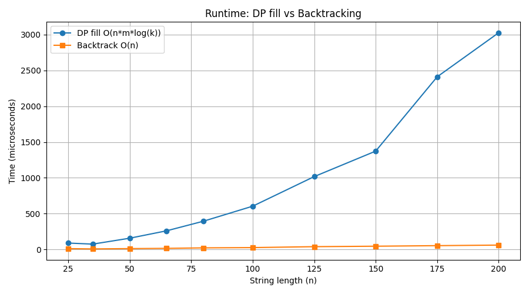

# Programming Assignment 3
Aidan Boudreau  
22043059  

## Overview

**Goal:** Create an optimized dynamic programming algorithm to find the maximum value common subsequence of two strings.

---

## Input Format

First line - number of characters in the alphabet being used (k)  
K lines after - letter and value of aligning that letter, space in between  
Line after - string A  
Line after - String B  


**Example input:**

3  
a 2  
b 4  
c 5  
aacb  
caab  

**Example output:**

9  
cb  

First line - max value of common subsequence  
Second line - the subsequence itself.  

---

## Running the Program

```bash
# Clone/download into folder, then:
g++ main.cpp -o main.exe
./main.exe
```

Change `input.txt` before running. View output in `output.txt`. Will also need g++ compiler, or can use another c++ compiler of your chosing. command is given for g++.

---

## Question 1: Empirical Comparison



---

## Question 2: Recurrence Equation

```
OPT[i][j]=	{ 0                                             i=0
		    { 0                                             j=0
		    { max {Vi+dp[i-1][j-1],dp[i-1][j],dp[i][j-1]}   A[i]=B[j]
		    { max {dp[i-1][j],dp[i][j-1]}                   A[i]!=B[j]
```

**Explanation:** Create a 2d array with the cols of string A backwards and rows of string B, backwards. Start in the bottom left corner. All cols and rows that are 0 are set to 0, which is because we cannot make a subsequence if one of the strings is empty. Then we work our way to the top left. If theres a match we add the value of the match to the diagonal bottom right value, or we take from the cell to the bottom or right, whichever is bigger. Then if there isnt a match then we just grab the largest value thats either down or to the right. This works throughout the algorithm and the cell with the max value is the top leftmost cell: dp[nA][nB].

---

## Question 3: Big-O

**Pseudocode:**
```
for i = 0 to nA:
    dp[i][0] = 0
for j = 0 to nB:
    dp[0][j] = 0

for i = 1 to nA:
    for j = 1 to nB:
        if A[i] == B[j]:
            dp[i][j] = max{ V(i) + dp[i-1][j-1], dp[i-1][j], dp[i][j-1] }
        else:
            dp[i][j] = max{ dp[i-1][j], dp[i][j-1] }

return dp[nA][nB]
```

**Space complexity:** `O(n * m)` — a 2D table of size `(nA+1) x (nB+1)`. nA is size of string A, nB is size of string B  

**Time complexity:** `O(n * m * log(k))` — Ever cell is filled one time in the 2d array, but the lookup time for V(i) uses a map which has runtime of O(log(k)). k being the size of the alphabet.  
